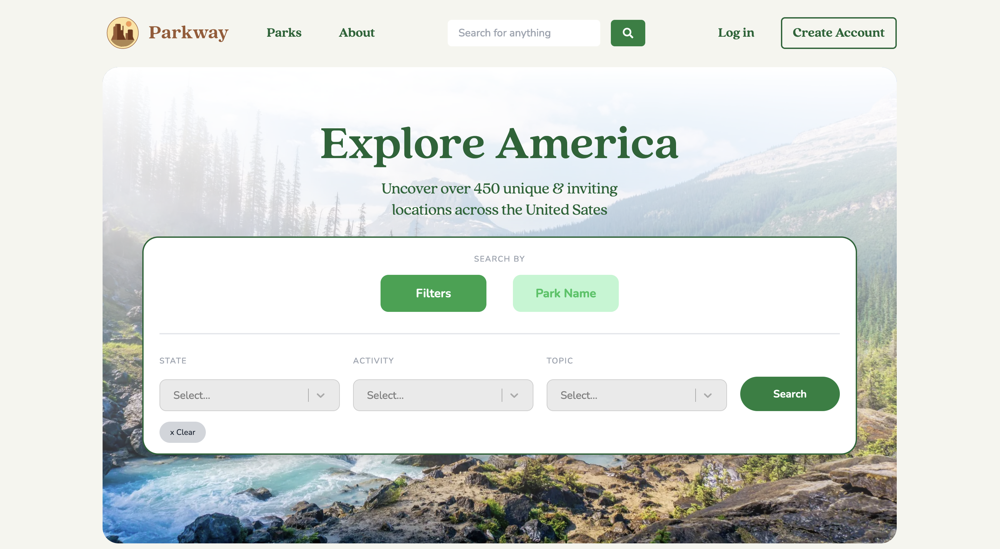

# Parkway– Visit National Parks

Parkway is the Goodreads for National Parks across America. Discover parks, save parks to you list of visited and want to visit places, and learn more about events near you. 

 

 

## 📖 Background

I love road tripping. On countless trips with friends and family it has been difficult to search for official parks sanctioned by the National Parks Service. Many of the websites I found were sponsored blogs that promoted already popular National Parks. What I and those around me wanted was a place to find the lesser traveled places. 

This is where Parkway was born. After a proof of concept MVP at Columbia college that myself and three of my classmates built, I took a break, but couldn't get this idea out of my mind. It wasn't until December of 2021, about six months after we pushed the first version when I started to rebuild the entire project from scratch. 

Fast forward to the last day of Februray 2022 and I've released a stable version of Parkway! More improvements are soon to follow, so be sure to come along me with this version. 

## 🏆 Goals

The two main goals of this project are to:

1. Build my technical knowledge on Next.js
2. Create a production website that REAL people can interact with and utilize

## ⚙️ How Parkway Works

## 🛠 Features

- 🏗 **Discover** every sansctioned National Park including National Seashores, Trails, Mounuments and more...
- 💾 **Save** all the parks you've visited or want to visit

Think of Parkway as the Goodreads for parks in America. View information for a park, and if it interests you, save it to your "Want to Visit" list or your "Visited List"

## 💻 Tech Stack

| Front End      | Backend                           | Packages       |
| -------------- | --------------------------------- | -------------- |
| React/ Next js | AWS Amplify (Hosting & CI/CD)     | Formik (Forms) |
| Tailwind css   | AWS Cognito (User Authentication) | Mapbox         |
|                | AWS Dynamo DB (Database)          | Splitbee       |
|                | GraphQL (API)                     |                |

## 🔮 Future Features

1. **Social Users**
I would like to add the ability to allow users to search for their friends and family to see where they have visited. They could also add them to trips and plan group trips together

2. **Guides**
Currently, through the many blogs, there aren't unbiased accounts of what to do at National Parks. I think it would be great to have unbiased or park rangers give their advice to what to do at parks.

# 👥 Contributing

I'm glad you are considering contributing to this project. I've poured a ton of hours into this and I would love to see any of your additions. Please read the following to make contributing easier for both you and me.

_Note_: If you need to access AWS credentials reach out to me and I can get you setup with that. 

## Step 1: Creating a branch

If you see an issue that sparks your interest or if you would like to contribute something else please follow this guide:

### Branch Structure

- Branches should follow this format
  - `feature/name-of-branch` (a new feature that is being made)
  - `update/name-of-branch` (an update to an existing feature)
  - `bug/name-of-branch` (a bug fix)

## Step 2: Create a PR

Once you are happy with your branch, submit a PR with comments and a descripting documenting what you changed.

When I get the notification that you submitted a PR, I will review the PR and if there are no errors, merge it into main. If however, there are errors, I will provide you with what errors exist so you can fix them.
